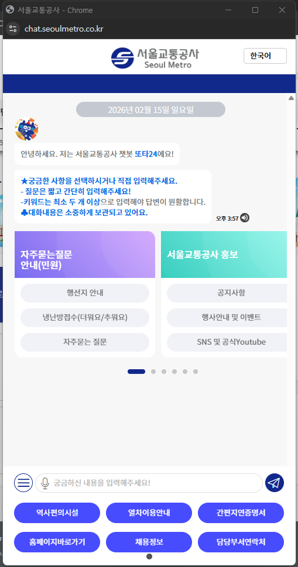

## 🏛️ 프로젝트 개요
* **프로젝트명:** 챗봇 재학습 및 프로세스 자동화 연동 솔루션 구축 ('또타')
* **발주처:** 서울교통공사
* **수행 기간:** 2022.12.31 ~ 2023.12.30
* **담당 역할:** 응용 SW 개발 (연구원)
* **주요 업무:**
    * 직원용 챗봇 내부 시스템(SAP) 연동 개발
    * 직원/대민용 챗봇 공통 REST API 서버 구축
    * 구축 이후 전반적인 시스템 유지보수 및 안정화 지원
* **URL:** [🌐 대민용 챗봇 바로가기 (https://chat.seoulmetro.co.kr)](https://chat.seoulmetro.co.kr/)

---

## 🛠️ Tech Stack
* **Language:** Java, JavaScript
* **Framework:** RESTful API
* **Interface:** SAP ERP 연동 (JCo/RFC 활용)
* **Database:** Oracle / MySQL (프로젝트 환경에 맞게 수정 가능)

---

## 💻 주요 개발 및 운영 내용

### 1. 챗봇 공통 REST API 구축
**"유연하고 확장 가능한 통신 모듈 개발"**
* 챗봇 엔진과 레거시 시스템 간의 원활한 데이터 교환을 위한 공통 REST API 설계 및 개발
* 대민용(고객)과 직원용 챗봇의 요청을 분기 처리하여 보안성 및 효율성 확보
* JSON 포맷을 활용한 경량화된 데이터 통신 구현으로 응답 속도 개선

*
▲ 서울교통공사 공식 챗봇 '또타' 대화 화면
*

 

### 2. 직원용 챗봇 SAP 연동 (백엔드 핵심)
**"사내 업무 효율화를 위한 ERP 데이터 연동"**
* **SAP 연동:** 서울교통공사 내부 ERP 시스템(SAP)의 데이터를 챗봇에서 조회할 수 있도록 RFC(Remote Function Call) 연동 모듈 개발
* **업무 자동화:** 휴가 잔여일수 조회, 급여 명세 확인 등 단순 반복 업무를 챗봇을 통해 자동화 처리
* 민감한 사내 데이터를 다루는 만큼 철저한 예외 처리 및 보안 로직 적용

 

### 3. 시스템 유지보수 및 고도화
**"안정적인 무중단 서비스 운영 지원"**
* 구축 이후 발생한 이슈 트래킹 및 버그 수정 (유지보수)
* 챗봇 시나리오 변경에 따른 API 로직 수정 및 배포
* 서버 모니터링을 통한 트래픽 부하 분산 및 장애 대응

---

## 🚀 트러블 슈팅 및 성과
* **SAP 연동 이슈 해결:** 폐쇄적인 SAP 환경과의 통신 중 발생한 데이터 타입 불일치 문제를 커스텀 매핑 로직으로 해결
* **유지보수 효율성 증대:** 반복되는 유지보수 요청을 분석하여, 관리자 페이지 기능을 개선하고 운영 매뉴얼화
* **성과:** 복잡한 내부 업무 프로세스를 챗봇으로 간소화하여 임직원 업무 편의성 향상에 기여