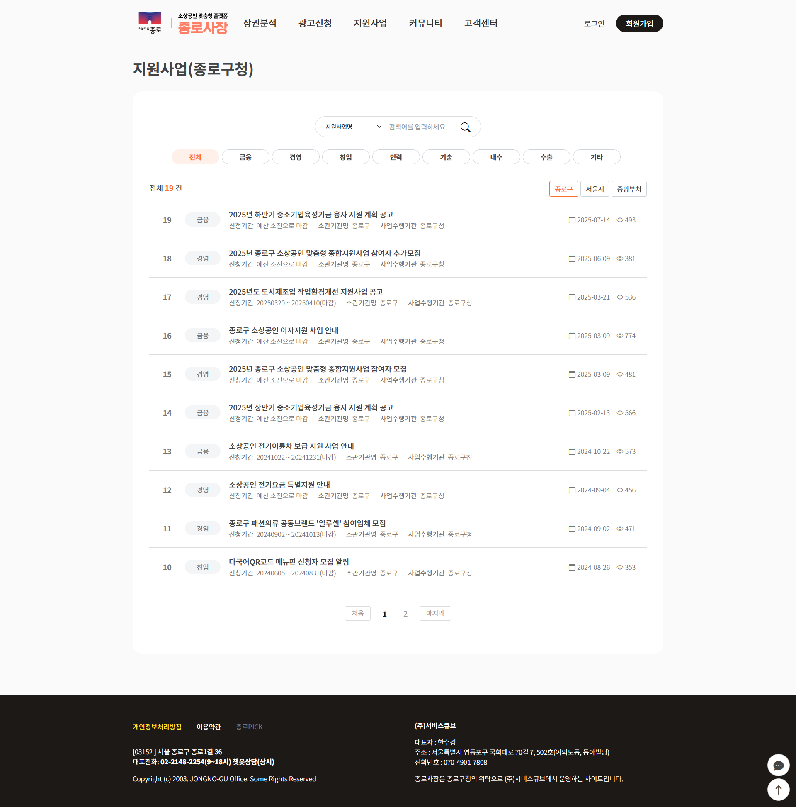

## 🏛️ 프로젝트 개요
* **프로젝트명:** 종로구 소상공인 지원 플랫폼 구축 ('종로사장')
* **발주처:** 종로구청
* **수행 기간:** 2023.11.30 ~ 2024.05.27
* **담당 역할:** 응용 SW 개발 (연구원)
* **참여 범위:**
    * **핵심 개발:** 메인 페이지, 지원사업 공고, 커뮤니티, 챗봇 서비스 구축
    * **기능 연동:** 상권분석 행정동 선택 UI 및 데이터 연동 (분석 로직 제외)
* **URL:** [🌐 사이트 바로가기 (https://market.jongno.go.kr)](https://market.jongno.go.kr/)

---

## 🛠️ Tech Stack
* **Framework:** Spring Boot, eGovFrame
* **Language:** Java, JSP, JavaScript, HTML/CSS
* **Database:** MySQL
* **Interface:** Chatbot API 연동

---

## 💻 주요 구현 기능

### 1. 메인 및 통합 정보 제공 서비스
**"사용자 친화적인 원스톱 정보 제공"**
* 소상공인에게 필요한 핵심 정보(지원사업, 상권분석 등)를 직관적으로 배치한 메인 대시보드 개발
* 로그인/회원가입 프로세스 및 사용자 권한 관리(소상공인/일반) 구현
* 배너 관리 및 팝업 시스템 구축으로 운영 편의성 증대

*
▲ 플랫폼 메인 화면: 주요 서비스 바로가기 및 추천 콘텐츠 제공
*

 

### 2. 지원사업 및 커뮤니티 게시판
**"공고 검색 편의성 강화"**
* **필터링 검색:** 분야별(금융, 경영, 창업 등) 탭 메뉴 적용으로 원하는 공고를 빠르게 찾을 수 있도록 구현
* **게시판 CRUD:** 공지사항, FAQ, 자유게시판 등 다양한 형태의 게시판 기능 개발 및 페이징 처리
* 조회수 집계 및 첨부파일 다운로드 기능 구현

*
▲ 지원사업 공고 목록: 카테고리별 탭 필터링 적용
*

 

### 3. 민원 응대 자동화 '챗봇 골목이' 구축
**"24시간 소상공인 민원 상담 지원"**
* 자주 묻는 질문(지원사업, 상권분석 등)에 대한 자동 응답 시나리오 개발
* 키워드 입력 및 버튼 클릭 방식의 하이브리드 인터페이스 구현
* 챗봇 UI 퍼블리싱 및 서버 통신 로직 개발

    
    

        <h4>🤖 주요 기능</h4>
        <ul>
            <li><strong>시나리오 기반 응대:</strong> 사용자가 자주 묻는 질문을 버튼 형태로 제공하여 접근성 향상</li>
            <li><strong>실시간 안내:</strong> 광고 신청, 지원사업 추천 등 핵심 메뉴 바로가기 제공</li>
            <li><strong>UI 최적화:</strong> 모바일 환경에서도 사용하기 편한 플로팅 버튼 및 대화창 구현</li>
        </ul>
    

 

### 4. 상권분석 (행정동 선택 모듈)
* 사용자가 상권 분석을 원하는 지역(행정동)을 지도에서 직관적으로 선택할 수 있는 UI 구현
* 선택된 지역 데이터를 분석 엔진으로 전달하는 프론트엔드 로직 개발

*
▲ 상권분석 지역 선택 화면: SVG 지도 기반 인터랙션 구현
*

---

## 🚀 트러블 슈팅 및 성과
* **챗봇 접근성 개선:** 기존 게시판 위주의 민원 처리를 챗봇으로 분산시켜 사용자 편의성 증대
* **데이터 시각화:** 복잡한 행정동 선택 과정을 지도 기반의 그래픽 인터페이스로 구현하여 직관성 확보
* **성과:** 종로구 내 소상공인의 정보 접근성을 높이고, 비대면 민원 응대 채널 확보에 기여