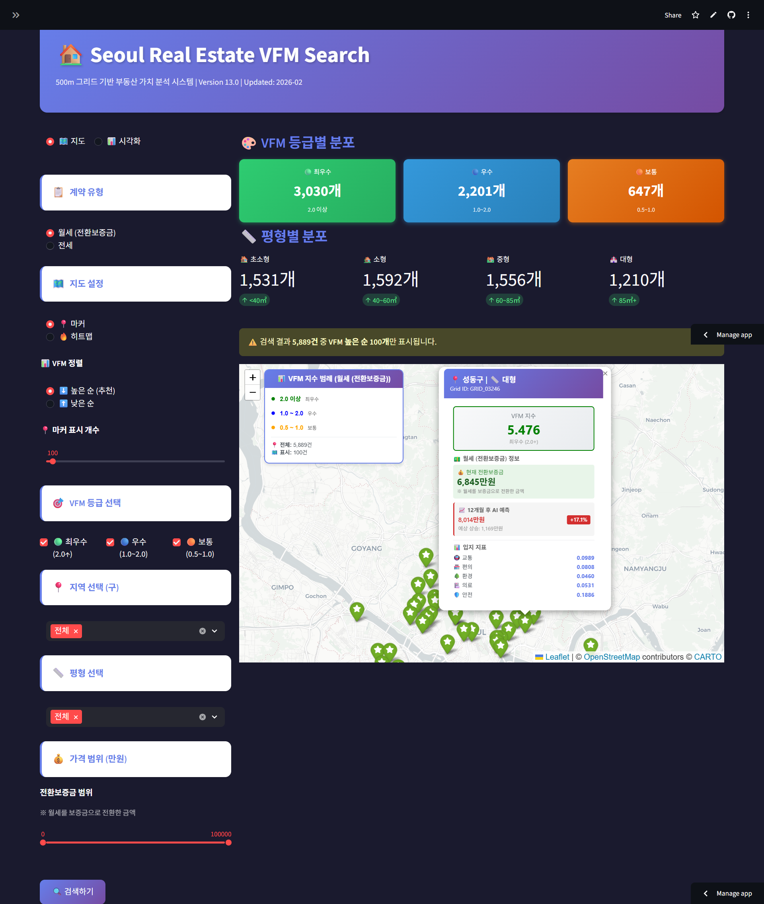
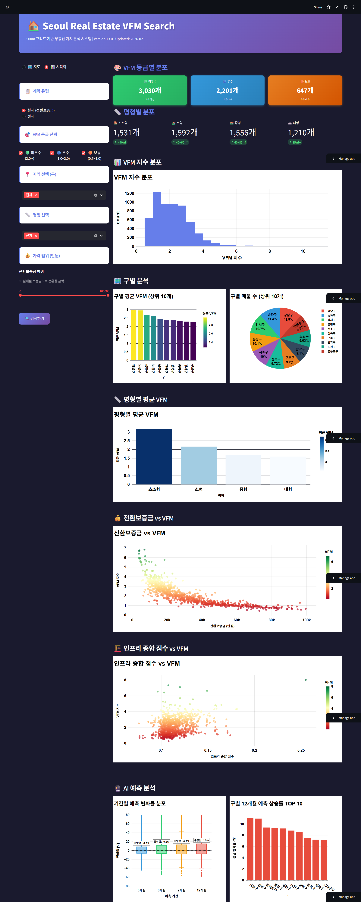

## 🏛️ 프로젝트 개요
* **주제:** 1인 가구 주거 비용 최적화 및 안전 인프라 분석을 통한 맞춤형 주거지 추천 플랫폼 
* **목표:** 서울시 전역을 500m 격자 단위로 세분화하여 미래 시세를 예측하고, 인프라 대비 저평가된 **'가성비(VFM) 지역'** 발굴 
* **개발 기간:** 2026.01.22 ~ 2026.02.04 
* **배포 URL:** <a href="https://seoul-real-estate-vfm-search-jdhcgptph8zj2d6vpvjmzc.streamlit.app/" target="_blank">🌐 Streamlit 실시간 서비스 바로가기</a>

---

## 💻 나의 역할 및 주요 기여
프로젝트의 핵심 분석 모델 구축과 실시간 사용자 인터페이스 구현을 전담했습니다.

* **GBR(Gradient Boosting Regressor) 모델링:** 시계열 데이터(금리, CPI, 거래가)를 학습하여 3/6/9/12개월 후의 미래 시세를 예측하는 백엔드 로직을 개발했습니다. 
* **앙상블(Ensemble) 아키텍처 설계:** 지도학습 모델인 GBR과 신경망 모델인 MLP를 결합하여 데이터의 시계열적 특성과 정적 인프라 가치를 동시에 반영하는 구조를 설계했습니다. 
* **Streamlit 기반 웹 서비스 구현:** 분석 결과를 지도(Heatmap) 및 차트 형태로 시각화하고, 사용자 맞춤형 필터링 기능을 포함한 통합 대시보드를 구축했습니다. 
---

## 📊 주요 분석 및 모델링 내용

### 1. 하이브리드 예측 모델링
* **미래 시세 예측(GBR):** 과거 보증금 이력과 거시경제 지표를 결합해 미래 전·월세가를 예측하며, 특히 전세 3개월 예측에서 $R^2 = 0.8354$의 높은 성능을 보였습니다. 
* **적정 가치 산출(MLP):** 치안, 교통, 환경 등 5가지 정적 인프라 지수를 입력값으로 하여 해당 입지의 실질적인 가치를 산출합니다. 

### 2. VFM(Value For Money) 지수 도출
* **공식:** $VFM Index = GBR 예측 시세 / MLP 적정 가치 
* **해석:** 지수가 1보다 크면 시장가 대비 저평가된 지역으로 판단하며, 성동구(1.46)와 중랑구(1.45)가 대표적인 가성비 우위 지역으로 분석되었습니다.

---

## 💻 시스템 구현

|  |  |
| :---: | :---: |
| ▲ 지도 기반 격자별 VFM 분석 화면 | ▲ 구별/평형별 통계 시각화 대시보드 |

* **실시간 필터링:** 계약 유형, 평형, 예산 범위를 설정하여 맞춤형 주거지를 실시간으로 탐색할 수 있습니다. 
* **격자별 리포트:** 선택한 격자(500m 단위)의 인프라 상세 점수와 AI 기반 미래 예측가를 팝업 형태로 제공합니다. 

---

## 🚀 성과 및 기대효과
* **데이터 기반 통찰:** 기준금리와 임대료 간의 상관계수 0.9651을 확인하고, 시장별 반영 시차(3~6개월)를 데이터로 입증했습니다.
* **사회적 가치:** 정보 비대칭성이 큰 청년 세대에게 금리 변동 시나리오에 따른 선제적인 주거 전략을 제안합니다.

---

## 📂 관련 문서 다운로드
* <a href="/files/brainstorming_practice.pdf" target="_blank">📄 2-1. 브레인스토밍 정의서</a>
* <a href="/files/bigdata_definition_v2.pdf" target="_blank">📄 3-3. 빅데이터 분석 정의서</a>
* <a href="/files/timeseries_project_presentation.pdf" target="_blank">📄 2차 시계열 프로젝트 발표 자료</a>