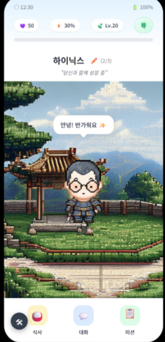
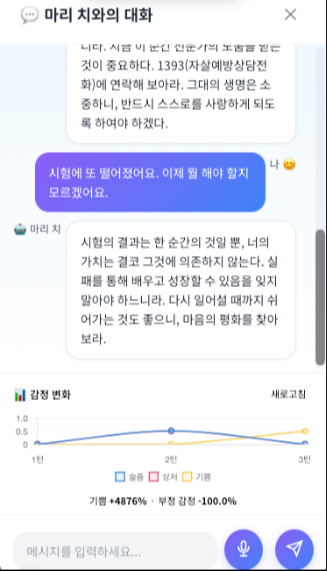

## 🏛️ 프로젝트 개요
* **주제:** 역사적 위인의 사고방식을 조합해 사용자 맞춤형 AI 멘토를 생성하고, 상호작용을 통해 성장시키는 퍼스널 AI 시뮬레이션 시스템
* **목표:** 위인 10명의 14차원 성격 벡터를 비율 조합하여 고유한 멘토 페르소나를 생성하고, 감정 분석 기반 맞춤형 응답을 3초 이내로 제공
* **개발 기간:** 2026.03 ~ 2026.04.07
* **배포 URL:** <a href="https://fascinating-stroopwafel-73e60b.netlify.app" target="_blank">🌐 Divine Tamagotchi 서비스 바로가기_서버를켜야 정상작동함</a>

---

## 💻 나의 역할 및 주요 기여
프로젝트의 AI 모델 통합, API 서버 구축, 프론트엔드 게임 UI, 그리고 배경 이미지·TTS 모델을 전담했습니다.

* **모델 통합 & API 서버 구축 (FastAPI):** 감정 분석(XLM-RoBERTa), 위기 감지(Mental-RoBERTa), 멘토 응답 생성(Qwen 2.5-7B+LoRA) 등 5개 이상의 AI 모델을 하나의 FastAPI 서버로 통합하고, `/chat`, `/analyze`, `/stt`, `/game/*` 등 15개 이상의 REST API 엔드포인트를 설계·구현했습니다.
* **배경 이미지 생성 모델:** Stable Diffusion 기반 16bit 픽셀아트 스타일의 배경 이미지 생성 파이프라인을 구축하여, 사용자 감정 상태에 따라 동적으로 배경이 변화하는 기능을 개발했습니다.
* **TTS(Text-to-Speech) 연동:** 멘토 응답을 음성으로 출력하는 TTS 기능을 추가하여 음성 기반 인터랙션 경험을 구현했습니다.
* **프론트엔드 게임 UI:** HTML/CSS/JS 기반의 다마고치 인터페이스를 개발하고, 감정 타임라인(Chart.js), 아바타 성장 시스템, 식사·미션 등 게임 메커니즘을 프론트엔드에 반영했습니다.

---

## 📊 주요 분석 및 모델링 내용

### 1. End-to-End AI 파이프라인
사용자 입력(텍스트 또는 음성)을 받아 감정/의도 분석 → 위기 감지 → 스탯 계산 → 멘토 응답 생성까지 전 과정을 하나의 API 호출(`/chat`)로 처리하는 파이프라인을 설계했습니다. Whisper(한국어 STT)를 통한 음성 입력도 지원하며, 조건부로 MiroFish 미래 예측 시뮬레이션까지 연동됩니다.

* **감정/의도 분류 (XLM-RoBERTa Large):** 7가지 감정(기쁨, 슬픔, 분노, 불안, 상처, 당황, 중립)과 8가지 의도를 Multi-label Sigmoid로 동시 분류하며, 감정 라벨 전체 AUC 0.95~1.00, 위기신호 AUC-ROC 0.999를 달성했습니다.
* **멘토 응답 생성 (Qwen 2.5-7B + LoRA):** 위인 10명 × 3,000개 = 총 30,000개의 균등 학습 데이터로 파인튜닝하였으며, 4-bit 양자화로 Colab T4 GPU에서 실행 가능하도록 최적화했습니다.

### 2. Fusion Engine — 14차원 성격 벡터 합성
위인 10명 각각에 대해 인내, 공감, 통찰, 평온, 끈기, 호기심, 절제, 전략, 리더십, 겸손, 카리스마, 창의, 지혜, 비전의 14차원 성격 벡터를 정의하고, 사용자가 설정한 위인 비율(예: Buddha 50% + Jobs 30% + Socrates 20%)에 따라 가중 평균을 계산하여 동적 시스템 프롬프트를 생성합니다. 이를 통해 동일한 고민에도 멘토 합성 비율에 따라 완전히 다른 스타일의 응답이 생성됩니다.

### 3. 다마고치 게임 시스템
대화를 통해 친밀도(0~100), 피로도(0~100), 경험치가 변화하며, 알 → 아기 → 성인 → 전설 단계로 아바타가 성장합니다. 식사·미션·대화 등 게이미피케이션 요소를 결합하여 사용자의 지속적인 정서적 교감을 유도합니다.

---

## 💻 시스템 구현

|  |  |
| :---: | :---: |
| ▲ 멘토 대화 & 감정 분석 인터페이스 | ▲ 다마고치 아바타 성장 & 게임 UI |

* **FastAPI 서버:** Google Colab 위에서 ngrok 터널링으로 외부 접속을 제공하며, 모든 AI 모델을 GPU 메모리에 동시 로딩하여 응답 지연을 최소화했습니다.
* **주요 API 엔드포인트:** `/chat`(핵심 — 감정분석+위기감지+멘토응답), `/analyze`(텍스트 감정만 분석), `/stt`(음성→텍스트), `/survey`(설문→멘토 DNA 산출), `/generate/background`(배경 이미지 생성), `/emotion-timeline`(감정 변화 시각화), `/game/*`(게임 상태 관리 6종)
* **감정 타임라인:** 대화 이력의 감정 변화를 Chart.js로 시각화하여 사용자에게 자신의 감정 흐름을 직관적으로 보여줍니다.

---

## 🚀 성과 및 기대효과
* **7개 KPI 전체 달성:** Macro F1 0.7234, 위기신호 AUC-ROC 0.999, 응답 생성 3초 이내, 페르소나 일관성 블라인드 테스트 97% 등 정량·정성 지표를 모두 충족했습니다.
* **사회적 가치:** 23%의 사용자가 이미 AI에게 정서적 지원을 구하고 있는 현실에서, 단순 Q&A가 아닌 '기억하고 성장하는 관계형 에이전트'를 제시하여 지속 가능한 정서적 교감 모델을 구현했습니다.

---

## 📂 관련 문서 다운로드
* <a href="/files/bigdata_definition_v3.pdf" target="_blank">📄 빅데이터 분석 정의서</a>
* <a href="/files/divine_tamagotchi_presentation.pdf" target="_blank">📄 프로젝트 발표 자료 (PPT)</a>