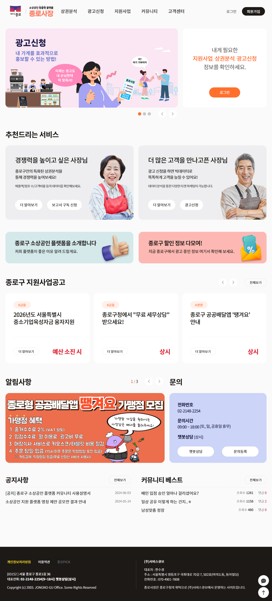

## 🏢 회사 소개 및 담당 직무
* **회사명:** 와우커뮤니케이션(주)
* **재직 기간:** 2022.09 ~ 2025.09 (약 3년 1개월)
* **주요 역할:** 응용 SW 개발 (백엔드 및 프론트엔드 기능 구현, 솔루션 R&D)

---

## 📂 주요 참여 프로젝트
공공기관 SI 구축 및 자사 솔루션 고도화(R&D) 업무를 수행했습니다.
각 프로젝트의 **[상세 보기]**를 클릭하면 더 자세한 개발 내용과 트러블 슈팅 과정을 확인하실 수 있습니다.

### 1️⃣ 종로 뉴미디어 플랫폼 구축 (SI)
* **발주처:** 종로구청 / 종로문화재단
* **수행 기간:** 2025.04.10 ~ 2025.09.25
* **역할:** 응용 SW 개발 (연구원)
* **주요 내용:**
    * 종로구청 뉴미디어 콘텐츠 아카이빙을 위한 웹 플랫폼 구축
    * 지도 API(GIS) 기반의 문화 시설 시각화 및 검색 기능 구현
    * 전자정부프레임워크 기반의 백엔드/프론트엔드 전반 기능 개발
* **Tech Stack:** **eGovFrame**, Java, MySQL, JSP, Map API

> **[👉 프로젝트 상세 보기 (Click)](/posts/2025-09-25-jongno-platform/)**
> *사이트 바로가기 및 상세 스크린샷 포함*

 

 

### 2️⃣ 종로구 소상공인 지원 플랫폼 '종로사장' (SI)
* **발주처:** 종로구청
* **수행 기간:** 2023.11.30 ~ 2024.05.27
* **역할:** 응용 SW 개발 (연구원)
* **주요 내용:**
    * 소상공인 지원사업 공고 및 커뮤니티 기능을 갖춘 통합 플랫폼 구축
    * 민원 응대 자동화를 위한 **챗봇 서비스('골목이') 시나리오 및 UI 개발**
    * 상권 분석을 위한 행정동 선택 UI(지도 기반) 및 데이터 연동 처리
* **Tech Stack:** Spring Boot, Java, JSP, MySQL, Chatbot API

> **[👉 프로젝트 상세 보기 (Click)](/posts/2024-05-27-jongno-sajang/)**
> *챗봇 시나리오 및 상권분석 UI 상세 설명*

 

 

### 3️⃣ 서울교통공사 챗봇 재학습 및 자동화 연동 (SI)
* **발주처:** 서울교통공사
* **수행 기간:** 2022.12.31 ~ 2023.12.30
* **역할:** 백엔드 개발 및 유지보수
* **주요 내용:**
    * 직원용 챗봇과 내부 ERP(**SAP**) 시스템 간의 데이터 연동 모듈 개발
    * 대민용/직원용 챗봇 공통 **REST API Server** 구축
    * 구축 이후 시스템 유지보수 및 시나리오 고도화 대응
* **Tech Stack:** Java, Spring Boot, **SAP(RFC)**, REST API

> **[👉 프로젝트 상세 보기 (Click)](/posts/2023-12-30-seoulmetro-chatbot/)**
> *SAP 연동 및 API 아키텍처 설명*

 

 

### 4️⃣ 중소기업 기술혁신 개발사업 (R&D)
* **과제명:** 시장 대응형 챗봇 재학습 간소화 기술 개발
* **수행 기간:** 2022.09.01 ~ 2024.07.31
* **역할:** 핵심 연구원 (Legacy Migration & AI 연동)
* **주요 내용:**
    * **Legacy Migration:** 10년 된 PHP 기반 시스템을 **Spring Boot(Java)**로 전면 리팩토링
    * **AI Model Serving:** BERT 기반 챗봇 모델 분석 및 웹 서비스 연동 파이프라인 최적화
    * **Add-on:** PDF 자동 생성 모듈 경량화 및 AI 기반 보안 인증 로직 개발
* **Tech Stack:** **Java(Spring Boot)**, PHP(Legacy), Python(AI Interface), BERT

> **[👉 프로젝트 상세 보기 (Click)](/posts/2024-07-31-chatbot/)**
> *시스템 마이그레이션 구조 및 R&D 성과*

---