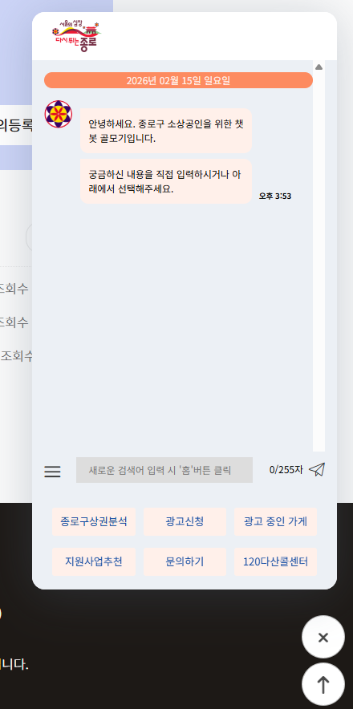
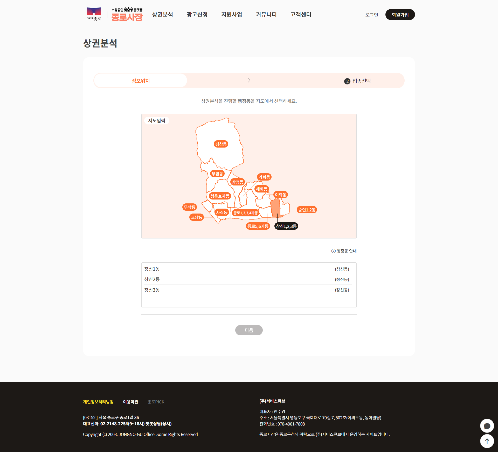

## 🏛️ 프로젝트 개요
* **프로젝트명:** 종로구 소상공인 지원 플랫폼 구축 ('종로사장')
* **발주처:** 종로구청
* **수행 기간:** 2023.11.30 ~ 2024.05.27
* **담당 역할:** 응용 SW 개발 (연구원)
* **주요 기여:** * **플랫폼 기반 구축:** 사용자 메인 프레임워크 및 관리자 페이지 전반 설계/개발
    * **자동화 시스템:** 가입 및 구독 회원 대상 지원사업/상권분석 정보 문자(SMS) 자동 발송 로직 구현
    * **핵심 서비스:** 챗봇 UI/UX 및 시나리오 통신 로직, 커뮤니티 게시판 구축
* **URL:** <a href="https://market.jongno.go.kr/" target="_blank">🌐 사이트 바로가기 (https://market.jongno.go.kr)</a>

---

## 🛠️ Tech Stack
* **Framework:** Spring Boot, eGovFrame
* **Language:** Java, JSP, JavaScript, HTML/CSS
* **Database:** MySQL
* **Communication:** SMS API (문자 발송), Chatbot API 연동

---

## 💻 주요 구현 기능

### 1. 플랫폼 메인 프레임 및 관리자 시스템 구축
**"효율적인 운영을 위한 통합 관리 환경 조성"**
* **프레임워크 설계:** 사이트 전체의 레이아웃(GNB/LNB) 및 권한별 접근 제어 로직 구현
* **통합 관리자 페이지:** 배너 관리, 팝업 설정, 회원 관리 등 운영자가 사이트 전반을 제어할 수 있는 관리 도구 단독 구축
* **메인 대시보드:** 소상공인에게 필요한 핵심 정보(지원사업, 상권분석 등)를 한눈에 볼 수 있는 UI 구현

*
▲ 플랫폼 메인 화면: 주요 서비스 바로가기 및 관리자 설정 연동
*

 

### 2. 구독 회원 맞춤형 정보 자동 알림 (SMS)
**"정보 접근성 극대화를 위한 푸시 서비스"**
* **문자 발송 엔진:** 가입 시 정보 수신에 동의한 회원을 대상으로 맞춤형 정보를 자동 전송하는 시스템 개발
* **알림 트리거:** 새로운 지원사업 공고 등록 시 지정일에 해당 카테고리 구독자에게 SMS 즉시 발송
* **이력 관리:** 관리자 페이지 내 발송 대상 필터링 및 전송 성공/실패 이력 로그 시스템 구축

 

### 3. 민원 응대 자동화 '챗봇 서비스' 및 커뮤니티
**"비대면 민원 채널 확보 및 검색 편의성 강화"**
* **챗봇 인터페이스:** 시나리오 기반 자동 응답 및 메뉴 바로가기 기능을 포함한 하이브리드형 챗봇 구축
* **필터링 게시판:** 분야별(금융, 경영, 창업 등) 지원사업 공고 검색 및 페이징 처리 시스템 최적화

    
    

        <h4>🤖 챗봇 주요 기능</h4>
        <ul>
            <li><strong>하이브리드 응대:</strong> 키워드 검색과 버튼 클릭 시나리오를 결합한 유연한 상담 환경 제공</li>
            <li><strong>UI/UX 최적화:</strong> 모바일 반응형 플로팅 UI 및 인터랙션 구현</li>
        </ul>
    

 

### 4. 상권분석 (행정동 선택 모듈)
* **SVG 지도 연동:** 사용자가 분석 지역을 지도에서 직접 선택할 수 있는 인터랙티브 지도 모듈 구현
* **데이터 파이프라인:** 프론트엔드에서 선택된 지역 정보를 백엔드 분석 엔진으로 전달하는 API 연동

*
▲ 상권분석 지역 선택 화면: 직관적인 인터랙션 UI 구현
*

---

## 🚀 트러블 슈팅 및 성과
* **운영 효율성 증대:** 관리자 기능을 직접 설계·구축하여 운영자의 수동 작업 시간을 단축하고 사이트 관리 편의성 극대화
* **푸시 마케팅 효과:** SMS 자동 발송 시스템 도입 후 지원사업 공고 조회수 및 사용자 참여도 유의미하게 향상
* **성과:** 24시간 비대면 민원 채널(챗봇)과 선제적 정보 제공(SMS)을 결합한 통합 소상공인 지원 환경 완성