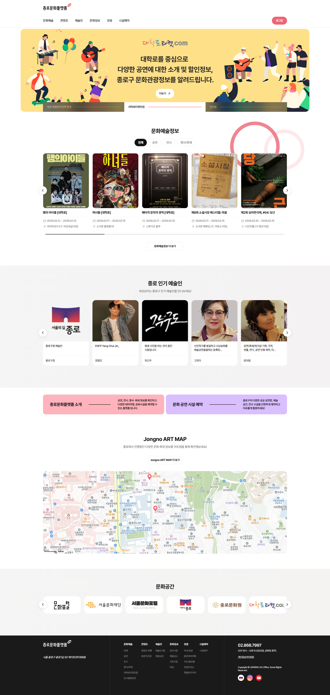
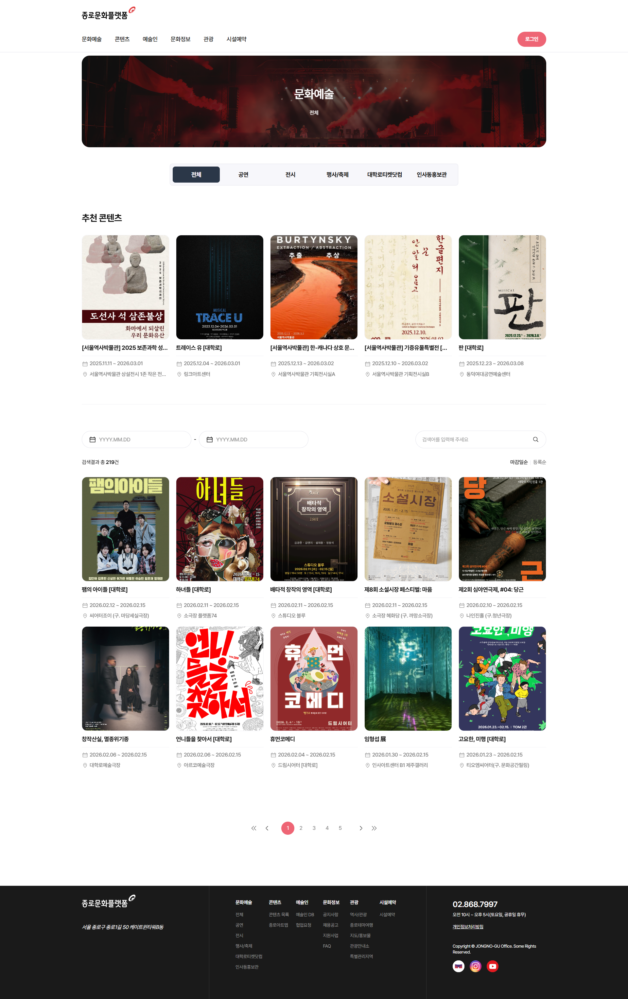
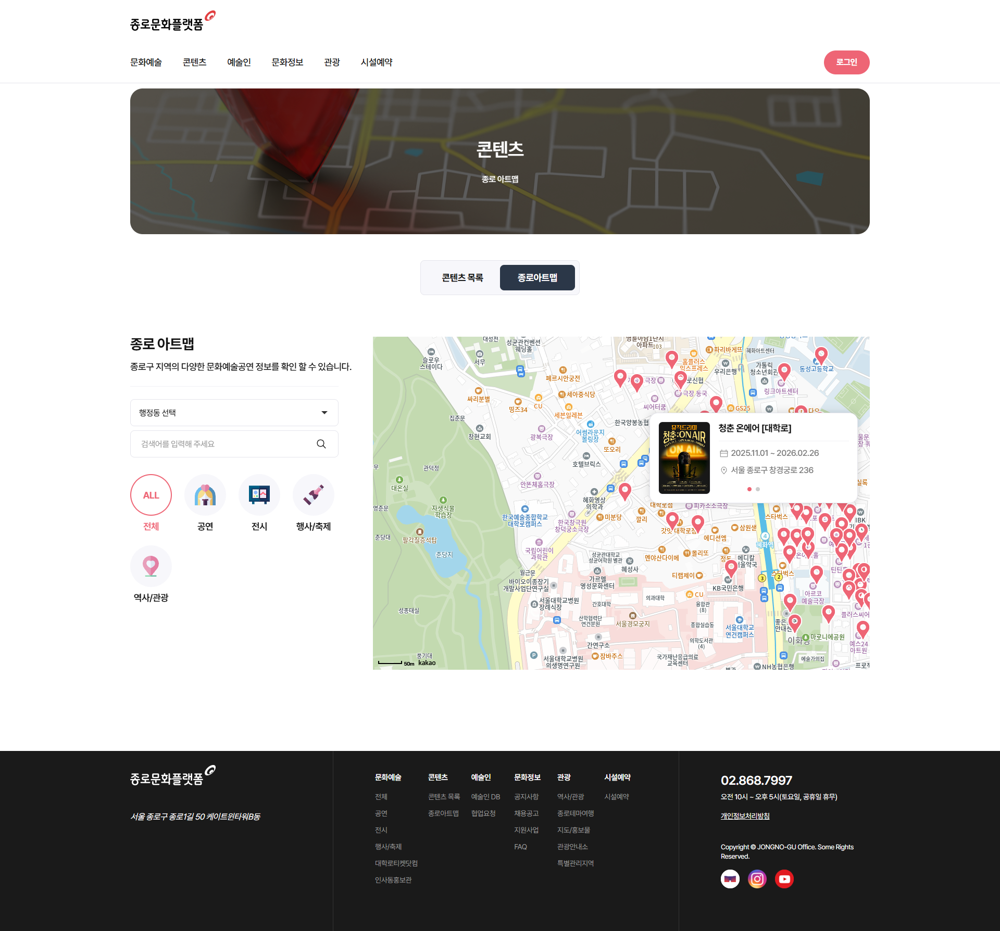
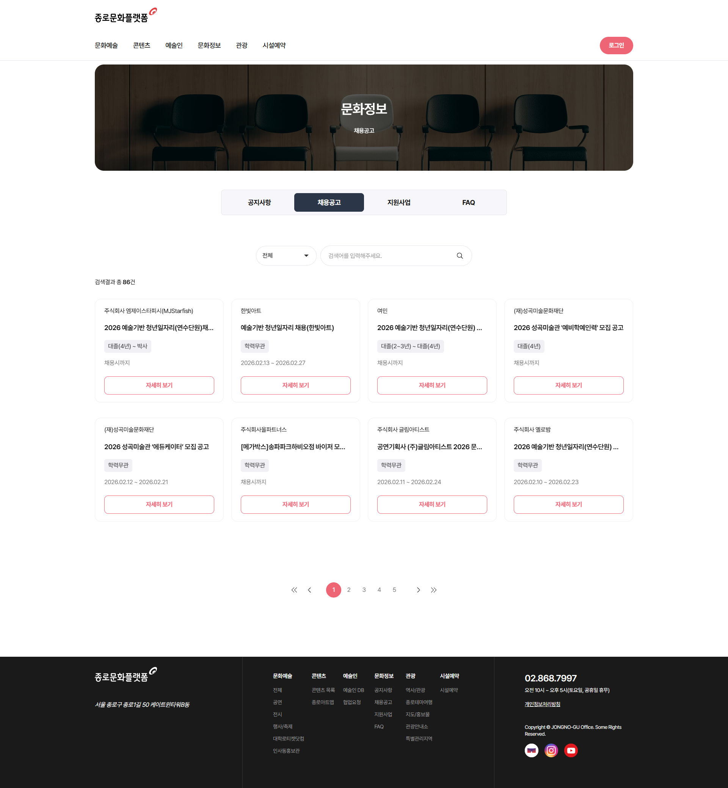
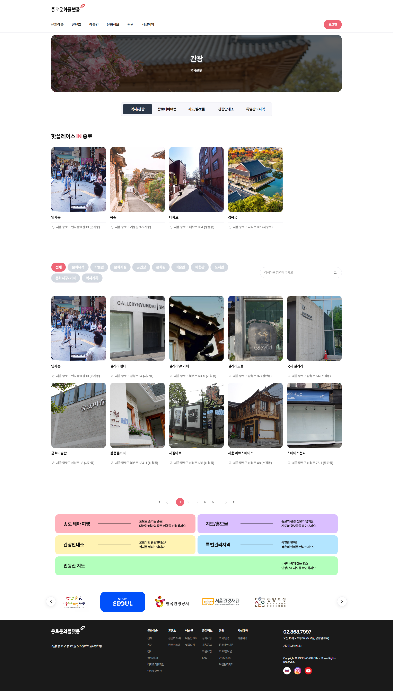

## 🏛️ 프로젝트 개요
* **프로젝트명:** 종로 뉴미디어 플랫폼 구축 (종로문화플랫폼)
* **발주처:** 종로구청 / 종로문화재단
* **수행 기간:** 2025.04.10 ~ 2025.09.25
* **담당 역할:** 응용 SW 개발 (연구원)
* **참여도:** 시설 예약을 제외한 **사이트 전반(메인, 콘텐츠, 지도, 문화정보 등) 구축**
* **URL:** [🌐 사이트 바로가기 (https://culture.jongno.go.kr)](https://culture.jongno.go.kr/media/ko/index.do)

---

## 🛠️ Tech Stack
* **Framework:** **eGovFrame (전자정부프레임워크)**, Spring Boot
* **Language:** Java, JSP, HTML/CSS, JavaScript
* **Database:** MySQL
* **API:** Map API (지도 서비스)

---

## 💻 주요 구현 기능

### 1. 메인 및 문화예술 아카이빙
**"사용자 경험(UX)을 고려한 직관적인 UI 구현"**
* 종로구의 방대한 문화 행사와 예술인 정보를 한눈에 볼 수 있는 메인 대시보드 구축
* 카테고리별(공연, 전시, 행사) 필터링 및 검색 기능 개발
* DB 최적화를 통해 다량의 콘텐츠 이미지 로딩 속도 개선

|  |  |
| :---: | :---: |
| ▲ 플랫폼 메인 화면 | ▲ 문화예술 콘텐츠 목록 페이지 |

 

### 2. 종로 아트맵 (GIS 기반 시각화)
**"위치 기반 문화 시설 찾기 서비스"**
* 지도 API를 활용하여 종로구 내 주요 문화 시설 및 행사 위치를 시각화
* 특정 동/지역 선택 시 해당 지역의 콘텐츠만 마커로 표시하는 필터링 로직 구현
* 사용자 위치 기반 주변 시설 추천 기능 연동

| |
| :---: |
| ▲ 종로 아트맵: 지도 API를 활용한 위치 기반 콘텐츠 제공 (상단 위주 노출) |

 

### 3. 정보 제공 및 커뮤니티 기능
**"관광 정보 및 알림 마당 구축"**
* **관광/핫플레이스:** 갤러리, 맛집 등 관광 정보를 카드뉴스 형태로 제공하는 갤러리 게시판 구현
* **채용/공지사항:** 게시글 등록, 수정, 삭제(CRUD) 및 페이징 처리가 포함된 게시판 로직 개발
* **반응형 웹:** 다양한 디바이스(PC, 태블릿, 모바일)에서 깨짐 없이 보이는 반응형 레이아웃 적용

|  |  |
| :---: | :---: |
| ▲ 공지 및 채용정보 게시판 | ▲ 관광 핫플레이스 갤러리 |

---

## 🚀 트러블 슈팅 및 성과
* **데이터 구조화:** 비정형화된 문화 예술 데이터를 카테고리화하여 확장 가능한 DB 스키마 설계
* **웹 접근성 준수:** 공공기관 웹 사이트 표준에 맞춰 스크린 리더 및 키보드 접근성 확보
* **성과:** 프로젝트 기간 내 성공적인 오픈 및 안정적인 서비스 운영 기여